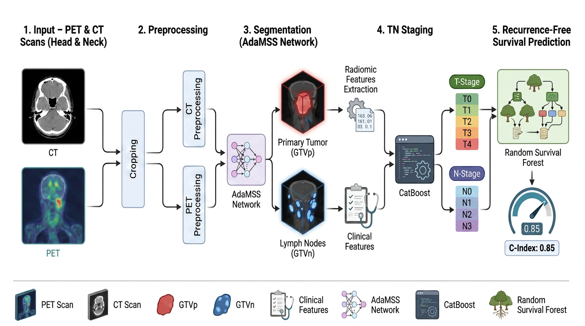

# Deep Learning-Based Segmentation and Feature-Based Clinical Prediction for Head and Neck Cancer

**Status:** Companion code for the HECKTOR 2026 challenge paper *(under review).*



# Reproducing the Experiments

The following steps reproduce the complete five-fold cross-validation pipeline used in this study. The commands below illustrate the workflow for **Fold 1**. The same procedure should be repeated for the remaining folds by replacing the corresponding training and validation split files and output directories.

It is assumed that the HECKTOR 2026 dataset has already been downloaded from the official challenge website and preprocessed according to the instructions provided in this repository.

## 1. Clone the Repository

Clone the repository and navigate to its root directory.

```bash
git clone [<repository_url>](https://github.com/segment-pioneers/hecktor2026)
cd hecktor2026
```

## 2. Create a Python Environment

It is strongly recommended to create a new Python environment before installing the required packages, as **imgaug** is incompatible with recent NumPy releases.

```bash
python -m venv hecktor_env
source hecktor_env/bin/activate      # Linux/macOS
```

or

```bash
conda create -n hecktor python=3.10
conda activate hecktor
```

Install the required dependencies:

```bash
pip install -r requirements.txt
```

## 3. Preprocess the Data
Before training, run `src/preprocessing/Preprocess_224.ipynb`.
- Set `ROOT` to the raw HECKTOR data root and `DESTINATION` to the output folder for preprocessed `.npz` files.
- Run all cells to resample to 1 mm isotropic and produce 224³ NPZ volumes.
Use `DESTINATION` as `--data_dir` / `/path/to/preprocessed_data/` in the following sections.

## 4. Navigate to the Source Directory

```bash
cd src
```

## 5. Configure the Python Package Path

This only needs to be executed once per terminal session.

```bash
export PYTHONPATH="$(pwd):$PYTHONPATH"
```

## 6. Segmentation

Train the AdaMSS segmentation model for Fold 1.

```bash
python -m segmentation.train_seg \
    --data_dir /path/to/preprocessed_data/ \
    --train_samples /path/to/data_splits/fold1_train.npy \
    --valid_samples /path/to/data_splits/fold1_valid.npy \
    --model_dir /path/to/output/segmentation/fold1/ \
    --log_dir /path/to/output/segmentation/fold1/logs/ \
    --epochs 50 \
    --steps_per_epoch 200 \
    --batch_size 2 \
    --device gpu0
```

## 7. TN Stage Classification

### 7.1 Extract Handcrafted Features

Extract handcrafted radiomic, anatomical, and clinical features from the preprocessed data.

```bash
python -m tn_staging.extract_tn_features \
    --data_dir /path/to/preprocessed_data/ \
    --clinical_csv /path/to/HECKTOR_2026_training_data.csv \
    --output_cache /path/to/output/gt_tn_features_37.pkl
```

### 7.2 Train the TN Stage Classifiers

Train the independent CatBoost classifiers for T-stage and N-stage prediction.

```bash
python -m tn_staging.train_tn \
    --feature_cache /path/to/output/gt_tn_features_37.pkl \
    --clinical_csv /path/to/HECKTOR_2026_training_data.csv \
    --train_samples /path/to/data_splits/fold1_train.npy \
    --valid_samples /path/to/data_splits/fold1_valid.npy \
    --model_dir /path/to/output/tn_staging/fold1/ \
    --seed 42
```

### 7.3 Generate TN Stage Probability Predictions

Generate the TN-stage probability distributions that will be used by the survival prediction model.

```bash
python -m tn_staging.predict_tn \
    --feature_cache /path/to/output/gt_tn_features_37.pkl \
    --t_model_path /path/to/output/tn_staging/fold1/best_t_model.cbm \
    --n_model_path /path/to/output/tn_staging/fold1/best_n_model.cbm \
    --output_file /path/to/output/tn_staging/fold1/tn_predictions.pkl
```

## 8. Recurrence-Free Survival Prediction

### 8.1 Extract Survival Features

Extract the handcrafted feature representation used for recurrence-free survival prediction. Create the output directory (e.g., /path/to/output/survival/fold1) first if it does not exist (the script does not create it automatically):
```bash
mkdir -p /path/to/output/survival/fold1/


```bash
python -m survival.extract_surv_features \
    --data_dir /path/to/preprocessed_data/ \
    --clinical_csv /path/to/HECKTOR_2026_training_data.csv \
    --tn_predictions /path/to/output/tn_staging/fold1/tn_predictions.pkl \
    --seg_model /path/to/output/segmentation/fold1/best.pt \
    --device cuda \
    --train_samples /path/to/data_splits/fold1_train.npy \
    --valid_samples /path/to/data_splits/fold1_valid.npy \
    --output_file /path/to/output/survival/fold1/survival_features.pkl
```

### 8.2 Train the Survival Prediction Model

Train the Random Survival Forest (RSF).

```bash
python -m survival.train_surv \
    --features_file /path/to/output/survival/fold1/survival_features.pkl \
    --model_dir /path/to/output/survival/fold1/ \
    --random_state 42
```

## 9. Repeat for the Remaining Folds

Repeat **Sections 6–8** for Folds **2–5** by replacing the corresponding training and validation split files and output directories.

## Notes

1. **TN labels:** Train TN models on data splits (if you want to try a top split for validating the repository code) that include all T (T0–T4) and N (N0–N3) stages so probability vectors stay 5- and 4-dimensional; otherwise, survival feature extraction may fail (expected 41 features).
2. **Survival metrics:** C-index requires **at least one event** (`Relapse == 1`) in validation (and in training if train C-index is reported). All-censored sets will raise an error.
3. **NumPy / imgaug:** Segmentation augmentation uses `imgaug`. On setup or training errors, try changing the NumPy version (see `requirements.txt`) and reinstalling—pin conflicts vary by environment.

## Contact

If you encounter any issues while reproducing the experiments or have questions about the repository, please feel free to contact:

**Yasar Mehmood**  
Email: yasar.mehmood111@gmail.com
